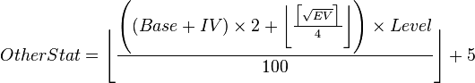

<h1 align="center">PythonRed Version</h1>

### Important Notes:

* This is not a perfect recreation of `Pokémon Red`; it's a fan-made game that takes place in the _Kanto_ region, the location of `Pokémon Red`.
* Prior in-depth knowledge of the `Pokémon` franchise, especially the video game series, is recommended and may be required to fully enjoy this game.
* `Windows` OS only!! This game makes use of `Python`'s `winsound` module, which is exclusive to `Windows`.
* This project (this GitHub Repository and anything found within) is not endorsed by _Nintendo_, _GAME FREAK_, or _The Pokémon Company_. This is an independent, fan-made game.
* This game's plot is a work of fiction! Any references to real people or historical events are completely accidental.

### To Play:
#### Step-by-Step Installation
##### 1. Installing `Python IDLE`

First, ensure you have `Python` installed. If not, you can find the latest installer [here](https://www.python.org/downloads/ "Python Latest"). Tick the box that says `Add Python to PATH` during installation.

However, if you are using a work/school computer and are not an Admin, you don't need to tick `py launcher`, which requires Administrative privileges to install. All `py launcher` does is let you use `Python IDLE` from the Command Line, which is not required for this game.

This also installs `pip`, the package installer for `Python`, which is required in the next step.

##### 2. Installing Dependencies
Open `Command Prompt` or `Windows PowerShell` and _individually_ run any below commands:

```
pip install playsound
```

(More commands will be added above as they are needed)

##### 3. Installing 7-zip
`Pokémon PythonRed` is released as an SFX '.exe' file, which requires 7-zip to open. Work/school computers can already have `7-zip` installed, but if not, the latest version can be found [here](https://7-zip.org "7-zip Latest").

##### 4. Downloading `Pokémon PythonRed`
When that's all done, to download the game, please download the latest (top) [Release](https://github.com/TurnipGuy30/Pokemon-PythonRed/releases "Pokémon PythonRed Releases"), and click the download link! These links redirect to OneDrive, as they are too large to be hosted on GitHub.

#### Summary
1. [Python IDLE](https://www.python.org/downloads/ "Python Latest")
2. Dependency Commands
3. [7-zip](https://7-zip.org "7-zip Latest")
4. [Releases](https://github.com/TurnipGuy30/Pokemon-PythonRed/releases "Pokémon PythonRed Releases")

### Bugs / Feature Request
For bugs, contributions or feature requests, please create an [Issue](https://github.com/TurnipGuy30/Pokemon-PythonRed/issues)!

### Credits
* Coming soon...

## SPOILERS PAST THE POKÉ BALL!
###### (Scrolling past is not recommended if you have never played Pokémon Red!)


<br><br><br><br>

### Resources Used:


<br>




### Progress:
* [x] Start menu
* [x] Intro
* [x] Pallet Town
* [x] Route 1
* [x] Viridian City
* [ ] Route 2
* [ ] Viridian Forest
* [ ] Pewter City
* [ ] Route 3
* [ ] Mt. Moon
* [ ] Route 4
* [ ] Cerulean City

Etc.

### Pokémon Data
The entire Kanto Pokédex is stored as a variable (list-of-lists), with a list item for each species:

```
pokemon = [[],[],[]...]
```

Each `[]` includes this:

```
[Pokédex #, Name, Type, Total Stats, Base HP, Base ATK, Base DEF, Base SP. ATK, Base SP. DEF, Base SPD]
```
Catch Rate will be based on Total Stats, as the Gen 1/2 Catch Rate formula is too complex, and it gets worse from then on.

For simplicity, Pokémon will only have one type each, and one attack each (a _`type`_-type attack).

#### _That's all, watch this space, and thanks!_

###### For reading this far, you get the privilege of seeing this li'l guy who just _might_ be a hidden starter (wink, wink!):

